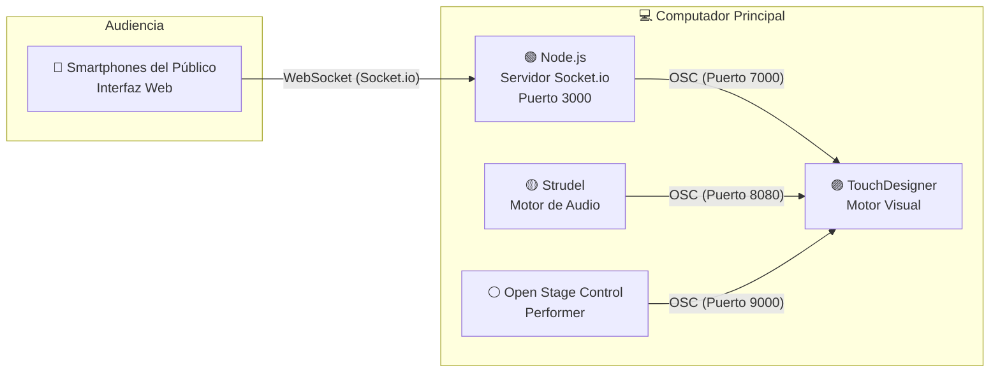

# Cosmos: Instalación Audiovisual Interactiva

Cosmos es un ecosistema audiovisual vivo moldeado por la interacción colectiva. La obra propone un diálogo a tres bandas: un pulso sonoro constante, un performer que guía la tensión narrativa a través de estados visuales (de un campo de estrellas a un vórtice profundo), y un público activo que, mediante sus propios dispositivos, tiñe e interviene la instalación en tiempo real. Es una exploración de cómo las interfaces web pueden difuminar la barrera entre el espectador y la obra.

## 1. Diagrama del sistema:

El sistema de la obra *Cosmos* se estructura como un ecosistema interactivo en tiempo real compuesto por cuatro componentes principales: **audio, visuales, performer y público**, conectados mediante protocolos de comunicación que permiten el flujo continuo de datos.



**Descripción del flujo de datos:**

- El **audio generado en Strudel** envía eventos mediante OSC a TouchDesigner, activando cambios visuales en tiempo real.
- El **performer**, a través de Open Stage Control, controla la transición estructural de la obra.
- El **público**, desde sus dispositivos móviles, envía información de color mediante Socket.io hacia un servidor Node.js, que traduce estos datos a OSC para modificar parámetros visuales.

El proyecto utiliza una arquitectura de red local distribuida mediante **OSC** y **WebSockets** para garantizar comunicación simultánea y fluida.

| Componente | Plataforma / Tecnología | Puerto de Entrada (TD) | Función Principal |
| :--- | :--- | :--- | :--- |
| **Audio (Pulsar)** | Strudel (Live Coding) + OSC Bridge | `8080` (UDP) | Sincroniza el parpadeo de la Luna mediante la detección del sonido `bd`. |
| **Performer** | iPad (Open Stage Control) | `9000` (UDP) | Controla la transición de estados (Estrellas → Vórtice) y el ciclo evolutivo de la obra. |
| **Público** | Smartphones (Node.js + Socket.io) | `7000` (UDP) | Envía datos de color RGB en tiempo real para teñir la Luna. |

## 2. Paso a paso para reproducir la obra

**Requisitos previos**

**Hardware:**

- Computador (Mac o Windows)
- Dispositivo móvil (celular)
- Tablet (opcional, para control del performer)

**Software:**

- TouchDesigner
- Node.js
- Navegador web
- Open Stage Control
- Strudel

**Instalación**

1. Clonar el repositorio:

```bash
git clone https://github.com/Valengp2006/Proyecto_Cosmos.git
cd Proyecto_Cosmos
```

2. Entrar a la carpeta `Servidor`

```bash
cd Servidor
```

3. Instalar dependencias:

```bash
npm install
```

> [!NOTE]
> Si se trabaja con Windows asegurarse de tener instalado `GitBash`, si es con MacOS se puede trabajar desde la terminal.

**Ejecución del sistema**

1. Iniciar el servidor:

```bash
cd Servidor
node server.js
```

2. Abrir TouchDesigner:

- Cargar el archivo `.toe`
- Verificar recepción OSC en puertos:
  - 8080 (audio)
  - 9000 (performer)
  - 7000 (público)

3. Ejecutar Strudel:

- Iniciar la partitura
- Verificar envío de datos OSC

4. Conectar Open Stage Control:

- Abrir el archivo `LauncherConfig` con la configuración del launcher de Open Stage Control
- Abrir el archivo `ClientUI` con la interfaz del performer
- Probar los slider y botón reset

5. Conectar público:

- Conectar dispositivos a la misma red
- Acceder a:

```
http://[IP-del-servidor]:3000
```

> [!NOTE]
> **Para Windows:** escribe `ipconfig` y presiona `Enter`.Busca la línea que dice `Dirección IPv4`.
> **Para Mac:** usa `ifconfig` y busca la sección `inet`

6. Verificar funcionamiento:

- La luna cambia de color
- Las visuales responden al performer
- Existe sincronización con el audio
- No hay latencia perceptible

## 3. Explicación y justificación

### Funcionamiento del sistema

El sistema se organiza en cuatro componentes:

- **Audio (Strudel):** genera la estructura sonora en tiempo real y define la evolución temporal.
- **Visuales (TouchDesigner):** construyen el entorno visual mediante partículas y reaccionan a inputs externos.
- **Performer (Open Stage Control):** controla la transición entre estados visuales.
- **Público (Web + Socket.io):** interviene modificando el color de la luna en tiempo real.

### Justificación técnica

- **OSC:** permite comunicación eficiente y en tiempo real entre audio y visuales.
- **Socket.io:** facilita la interacción multiusuario desde navegadores.
- **Node.js:** actúa como puente entre web y sistema visual.
- **TouchDesigner:** permite crear visuales complejas y reactivas.
- **Strudel:** permite generar estructuras sonoras dinámicas mediante live coding.

Estas herramientas permiten construir un sistema modular, estable y en tiempo real.

### Justificación estética

- La obra utiliza una estética espacial basada en nebulosas y cuerpos celestes.
- La paleta de colores (morado, rosado, naranja) está inspirada en imágenes astronómicas.
- El uso de partículas permite representar procesos de formación y movimiento.
- La luna funciona como elemento central y punto de conexión con el público.

### Relación concepto–técnica

El sistema distribuye el control de la experiencia:

- El **audio** define el tiempo
- El **performer** define la estructura
- El **público** introduce variación

Esto convierte la obra en un sistema dinámico donde múltiples agentes influyen en un mismo entorno.

## 4. Estructura del Repositorio

El repositorio está organizado en módulos independientes para facilitar su ejecución y comprensión:

- `/Visuales`: Contiene el archivo `.toe` principal de TouchDesigner con la síntesis visual.
- `/Servidor`: Entorno de Node.js, incluyendo `server.js` y la carpeta `/public` con la interfaz del espectador (`index.html`).
- `/Control`: Layout de configuración de interfaz para Open Stage Control.
- `/Audio`: Archivos de texto plano con la partitura generativa escrita en Strudel.
  
